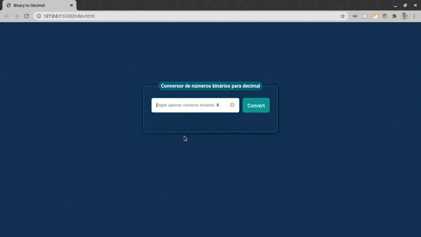

# BinToDec
O BinToDec é um conversor de números binários para números decimais.

## Features
* O usuário pode inserir até 8 números no campo.
* O usuário deve ser notificado caso outros números além de 0 ou 1 for inserido no campo.
* O usuário pode inserir números variados de dígitos binários.
* O usuário poderá visualizar o valor já convertido para a base 10.

## Screenshot
<table>
    <tr>
        <th width="100%">
            Web Interface
        </th>
    </tr>
    <tr>
        <td>
            
        </td>
    </tr>
</table>

## Tecnologias
* [JavaScript](https://developer.mozilla.org/pt-BR/docs/Web/JavaScript)
* [HTML](https://developer.mozilla.org/pt-BR/docs/Web/HTML)
* [CSS](https://developer.mozilla.org/pt-BR/docs/Web/CSS)